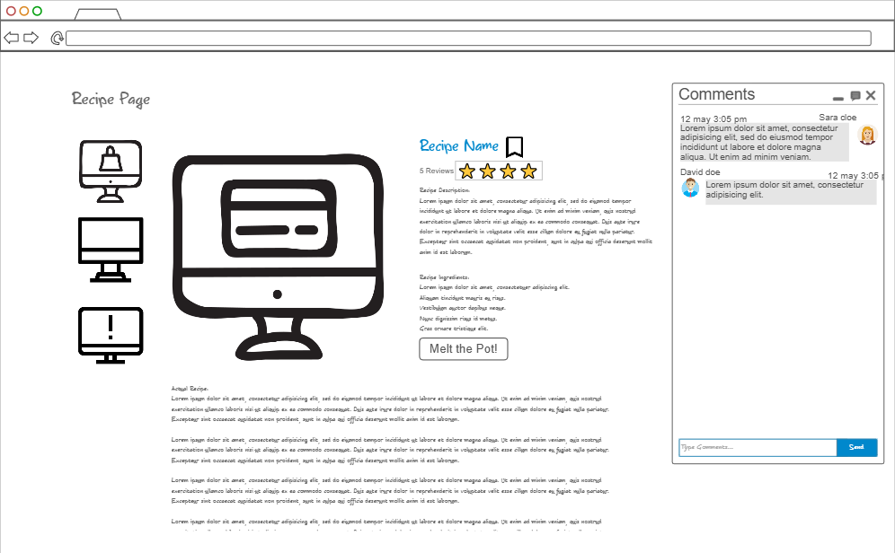

# Melting Pot

## What is Melting Pot?
Whether you're a culinary pro eager to share your recipes or a beginner looking to learn, Melting Pot is your go-to site! Melting Pot lets you upload and explore recipes, rate and comment on others, and even propose flavor tweaks with our "Mix the Pot" feature. Transform your cooking experience and connect with a vibrant community of food enthusiasts today!

## Design

## Key Features
 - User login to save recipes
 - Live chat to discuss recipes
 - Option to leave reviews
 - Option to submit requests/variations of recipe

## Technologies
 - HTML/CSS: Design an appealing interface for browsing, creating, and sharing recipes.
 - JavaScript: Implement interactive elements such as search filters, recipe ratings, and comment sections.
 - Web Services: Use APIs to fetch and store recipes and user data.
 - Authentication: Enable users to create accounts, submit recipes, and leave comments.
 - Data Storage: Store recipe details, user profiles, and comments in a persistent database.
 - Web Sockets: Allow real-time updates on recipe comments or live chat for recipe discussions.

 ## HTML deliverable

For this assignment I built out the HTML structure and content of my website

- **HTML pages** - HTML pages for a home page, login, submitting a recipe, browsing recipes, and a sample recipe.
- **Links** - The login page automatically links to the home page. The home page contains links for each category .
- **Text** - Each Recipe is in text.
- **Images** - There are pictures for each recipe. *all pictures are placeholders.
- **DB/Login** - Input box and submit button for login. The recipes and reviews represent data pulled from the database.
- **WebSocket** - The comments and reviews represent realtime commenters and reviewers.

## CSS deliverable

For this assignment I styled the website into its final appearance.

- **Header, footer, and main content body** - Header and footer are consistent across relavent pages
- **Navigation elements** - I dropped the underlines and styled a navbar with bootstrap
- **Responsive to window resizing** - My app looks great on all window sizes and devices
- **Application text content** - Consistent fonts throughout the site
- **Application images** - I have several images for different recipes

## React deliverable

For this assignment I used JavaScript and React so the app works for a user. I also added placeholders for other features.

- [x] **Bundled and transpiled** - done!
- [x] **Components** - Login, header, footer, recipe provider, and reviews are all components, some with mocks for login, WebSocket.
  - [x] **login** - When you press enter or the login button it takes you to the home page and displays your username.
  - [x] **database** - Displayed latest reviews. Currently this is not stored and will be wiped with refresh. Will use a database later.
  - [x] **application logic** - The rating of a recipewill change based on the user's reviews.
- [x] **Router** - Routing between pages and components.
- [x] **Hooks** - Recipeprovider uses useState to provide recipes for the recipes page.

## Service deliverable

For this deliverable, I added backend endpoints that handle user authentication, recipe management, and review submissions. I also added calls to third party APIS such as foodish and a Kanye West quote API

- [x] **Node.js/Express HTTP service** - Implemented a Node.js/Express server to handle HTTP requests.
- [x] **Static middleware for frontend** - Configured static middleware to serve the frontend.
- [x] **User Authentication** - Added endpoints for user registration, login, and logout. User sessions are managed using tokens stored in local storage.
- [x] **Recipe Management** - Created endpoints to add new recipes, fetch all recipes, and fetch a specific recipe by ID.
- [x] **Review Submissions** - Implemented endpoints to submit reviews for recipes and calculate the average rating based on user reviews.
- [x] **Frontend calls service endpoints** - Integrated the frontend with the backend using the fetch function to make API calls.
- [x] **Calls to third party endpoints** - Newly added recipes will be given a random image from `https://foodish-api.com/` and there is also a random kanye west quote on the home page from `https://api.kanye.rest/`.