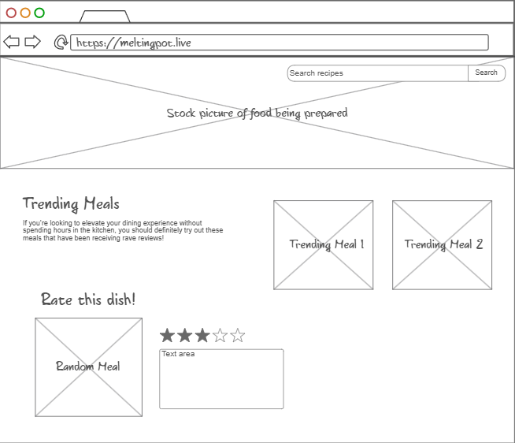
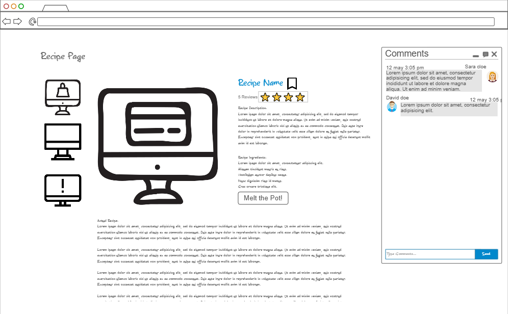

# Melting Pot

## What is Melting Pot?
Whether you're a culinary pro eager to share your recipes or a beginner looking to learn, Melting Pot is your go-to site! Melting Pot lets you upload and explore recipes, rate and comment on others, and even propose flavor tweaks with our "Mix the Pot" feature. Transform your cooking experience and connect with a vibrant community of food enthusiasts today!

## Design

## Key Features
 - User login to save recipes
 - Live chat to discuss recipes
 - Option to leave reviews
 - Option to submit requests/variations of recipe

## Technologies
 - HTML/CSS: Design an appealing interface for browsing, creating, and sharing recipes.
 - JavaScript: Implement interactive elements such as search filters, recipe ratings, and comment sections.
 - Web Services: Use APIs to fetch and store recipes and user data.
 - Authentication: Enable users to create accounts, submit recipes, and leave comments.
 - Data Storage: Store recipe details, user profiles, and comments in a persistent database.
 - Web Sockets: Allow real-time updates on recipe comments or live chat for recipe discussions.
